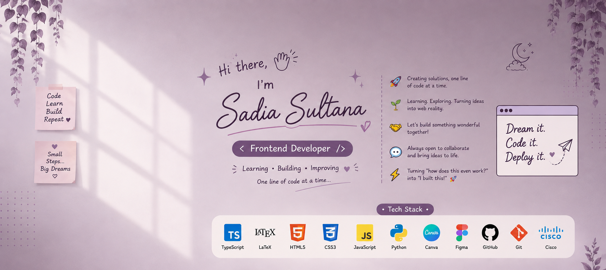

  

<ul align="center" type="none">

<h1 style="display :inline-block">Hi there, I'm Sadia Sultana 👋
  
  </ul> 
  
## 👩‍💻 About Me

- 🎓 Graduated in EEE from University of Chittagong
- 🔭 I'm currently working on building small projects with **JavaScript** and **React.js** to strengthen my frontend fundamentals
- 🤝 I'm looking for help with real-world **React** project structuring and best practices
- 🌱 I'm currently learning **JavaScript, TypeScript, DOM manipulation, and React.js**
- 💬 Ask me about **frontend basics, JavaScript, or the DOM**
- ⚡ Fun fact: I'm on a mission to turn "how does this even work?" into "I built this!" 🚀

## 🌐 Socials:

# 💻 Tech Stack:
  

      
# 📊 GitHub Stats:
 
 

## 🏆 GitHub Trophies

---

<!-- Proudly created with GPRM ( https://gprm.itsvg.in ) -->
<!--
**Sadia-IoT/Sadia-IoT** is a ✨ _special_ ✨ repository because its `README.md` (this file) appears on your GitHub profile.

Here are some ideas to get you started:

- 🔭 I’m currently working on ...
- 🌱 I’m currently learning ...
- 👯 I’m looking to collaborate on ...
- 🤔 I’m looking for help with ...
- 💬 Ask me about ...
- 📫 How to reach me: ...
- 😄 Pronouns: ...
- ⚡ Fun fact: ...
-->
